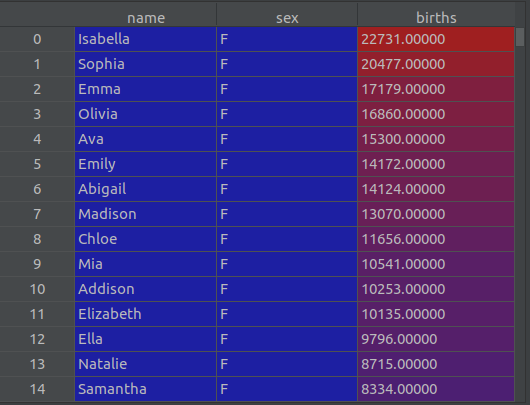
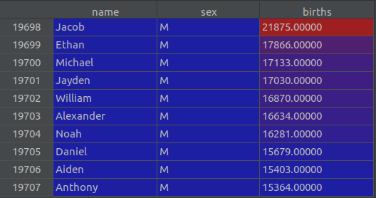

# US Baby Names Pandas Project
This subsection is dedicated to practicing some Pandas fundamentals. The dataset that was used was the US Baby Names dataset. This dataset includes the number of births as a function of the baby name. The sex of each baby name was also attached. The following is a snippet of the dataset:



*Figure 1: Snippet of the dataset*

The following tasks were attempted:

1. Add a column that includes the proportion of each birth count
2. Extract a subset of the data with the top 10 most common names for each sex
3. Aggregate the names by first letter and plot the frequency distribution for males and females separately

The results of each of the above tasks are displayed below:

1. Add a column that includes the proportion of each birth count


*Figure 2: Dataset with augmented proportion column*

2. Extract a subset of the data with the top 10 most common names for each sex



*Figure 3: Top 10 most common names for males*


*Figure 4: Top 10 most common names for females*

3. Aggregate the names by first letter and plot the frequency distribution for males and females separately


*Figure 5: First letter frequency distribution for males*


*Figure 6: First letter frequency distribution for females*


A strong understanding of the ```.groupby, .apply, .loc[], .iloc[], .sort_values, and .plot``` functions was obtained through this project.